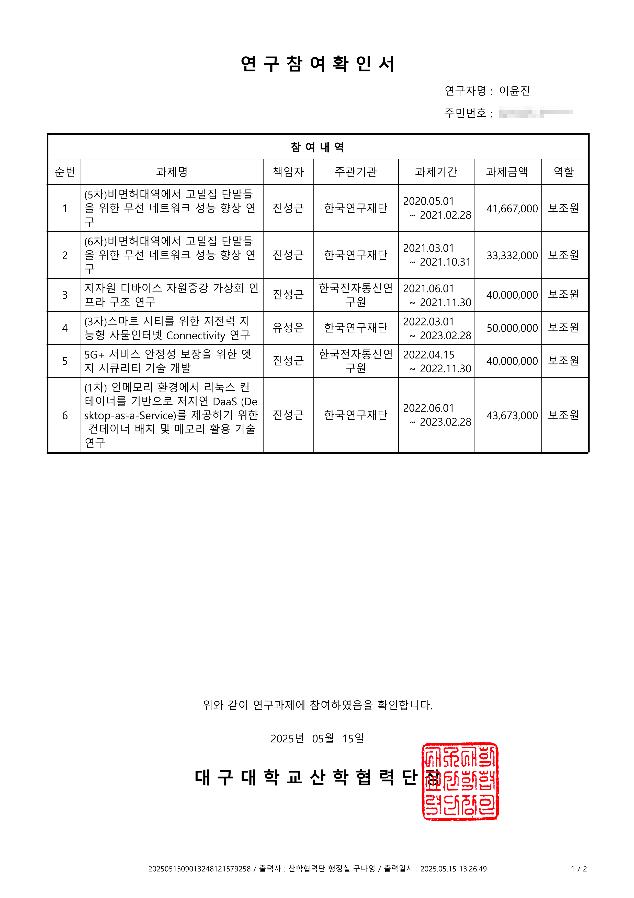
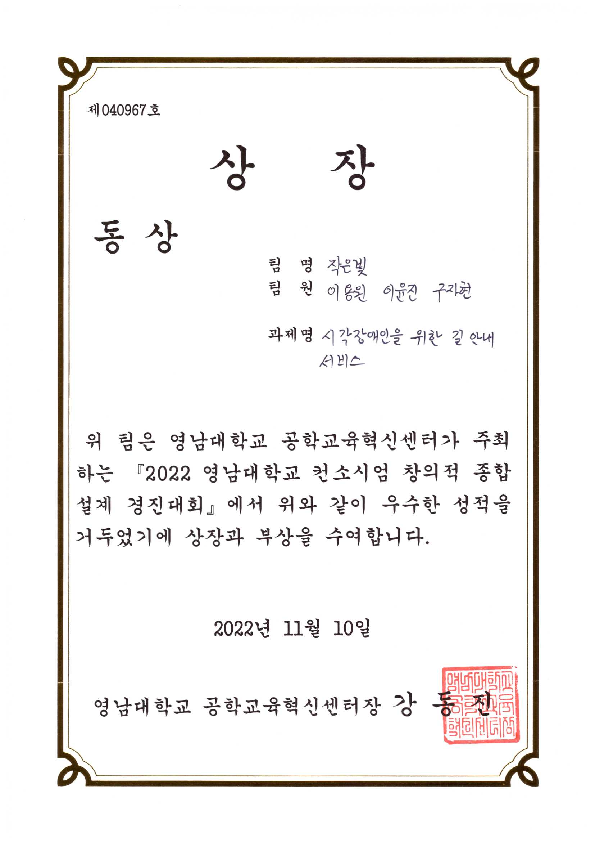
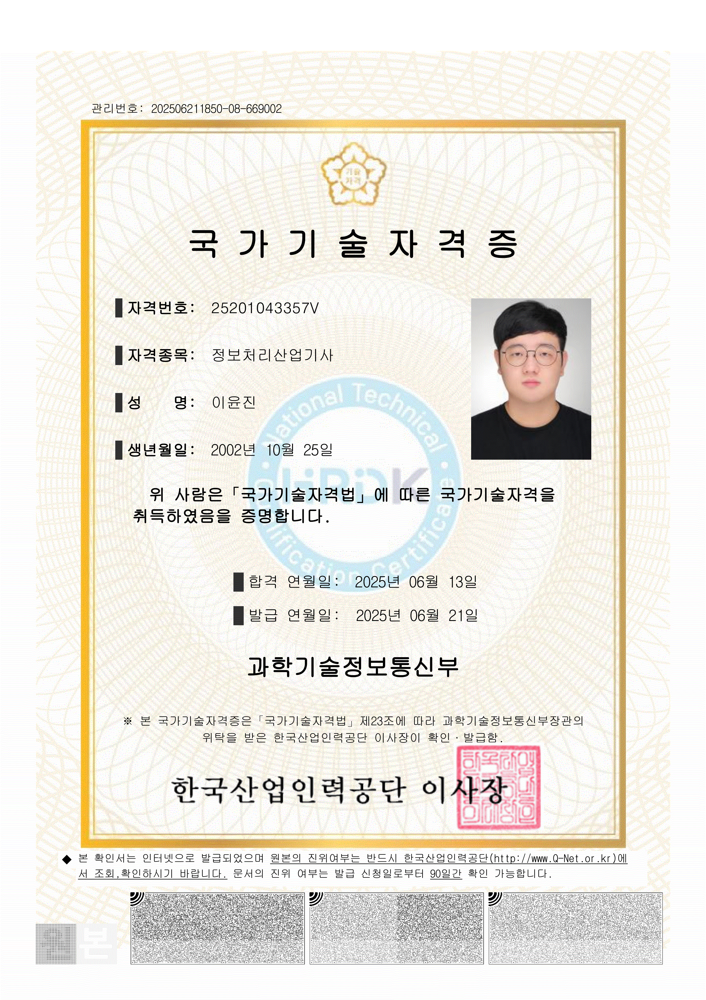

# Hi, I'm @gg582 (Lee Yunjin)

## About Me

I'm a college student with strong interests in Unix/Linux system management, automation scripting, container orchestration, and Go-based development.  
Currently learning Java and C# to expand my backend capabilities.

---

## 💻 Skills
| Language         | Level       | Experience       |
|------------------|-------------|------------------|
| C, C++           | Advanced    | Simulation, Drivers |
| Go               | Intermediate| GUI, Daemon         |
| Python           | Intermediate| Visualization       |
| Kubernetes       | Intermediate| Cluster Setup       |
| Ansible          | Beginner    | IaC                 |
| Helm             | Intermediate|   Deployment        |
----------------------------------------------------

[](https://solved.ac/yoonjin67)
[](https://github.com/anuraghazra/github-readme-stats)


## 🧩 Key Projects

### 🚗 RemoteCarFromMonet
- **Description**: Kubernetes-integrated remote car control system with C-based motor drivers and Go-based K8s deployment.
- **Tech Stack**: C, Go, Shell, Kubernetes
- **Lines of Code**: 4424 LOC
- **Highlight**: Simulates virtual car feedback and executes on physical hardware.

### 🖥️ IncuSpeed
- **Description**: Linux container manager with KivyMD GUI and Go-based secure daemon.
- **Tech Stack**: Go, Python, Shell, KivyMD, AES, bcrypt
- **Lines of Code**: 3052 LOC
- **Highlight**: Extremely simplified management of incus container

### 📊 Political Opinion Dynamics Simulator
- **Description**: Simulates political opinion spread across social strata using C (core logic) and Python (visualization).
- **Tech Stack**: C, Python
- **Highlight**: Models polarization and convergence, reflecting social theories like Social Identity Theory.

### 💻 NatPP (Nat++)
- **Description**: A lightweight DSL transpiled into C/C++ using regex, offering natural language constructs.
- **Tech Stack**: C/C++
- **Highlight**: Enhances code readability with keywords like `Then` for `{` and `Is` for `=`.

```cpp
ImportCode iostream
ImportCode map
ImportCode string

int main()
Then
    map From std <string From std, int> dict;
    
    dict["apple"] Is 5;
    dict["banana"] Is 3;
    
    ForEach(auto pair In dict)
    Then
        cout From std << pair.first << " " << pair.second << endl From std;
        FormattedPrint("1*4 = %d\n", 1 MoveLeft 2);
    Okay

Okay
```


### 🎮 Arkanoid-based Oriental Dotted Graphic Game
- **Description**: A 2D shooting game built with Unity and C#, featuring manual y-axis paddle control and oriental aesthetics.
- **Tech Stack**: Unity, C#
- **Highlight**: Includes block HP mechanics and ChatGPT-generated backgrounds, submitted to Daegu University’s Game Programming Basics lecture.

---

## 🧠 Interests

- Unix/Linux System Management
- Container Orchestration (Docker, Incus, Kubernetes, Ansible)
- Go Language (Tcl/Tk 9.0 GUI)
- Shell & Python Automation
- Java, C# (Learning)
## 🧠 Research Assistant Certificates

The award was focused on presentation.
Plus, there can be some problem while uploading collaborated code into this.
So, I attach the actual award.



This is a Korean certificates, for informational engineering. 

This is not 'high-leveled' certificates. But this needs some comments. 

I took the Industrial Engineer examination's first screening while I was not yet an undergraduate student.

Engineer certificates do not allow people who have graduated from a four-year college.

Also, colleges with 2 years courses cannot take this. In my opinion it is a kind of system limitation.

And I took a final test in 2025. If I can get enough time to get 'Engineer' examination,

which is one step higher than 'Industrial Engineer', I have courage to take.

The first screening pass rate was 51%. The final test's pass rate was 49.64%, which is somewhat easier than the 2023–2024 test.

Test checks skills about MVC structure, and Development process, and a bit of SQL/Java/Unix.

---

## 📫 Contact

- Email: [gg582@naver.com](mailto:gg582@naver.com)
---


## 🎧 Personal Note

I enjoy vinyl records and various kinds of music in my spare time. Vinyl records are easy to care.
SPK, François Couperin, Coil, Sidiki Diabaté, Korean traditional music, Chinese pipa,  

Japanese traditional music from the Edo period, Iannis Xenakis (Greek: Ιάννης Ξενάκης), Blind Willie McTell, Johnny Winter, etc.

Owns some Rock, Blues, Classical, Baroque, and Jazz vinyls.

As an oldies pick, how about Led Zeppelin and Chuck Berry? 😉


---

## 🔗 Stats & Profiles

[](https://git.io/streak-stats)  
[](https://github.com/anuraghazra/github-readme-stats)
