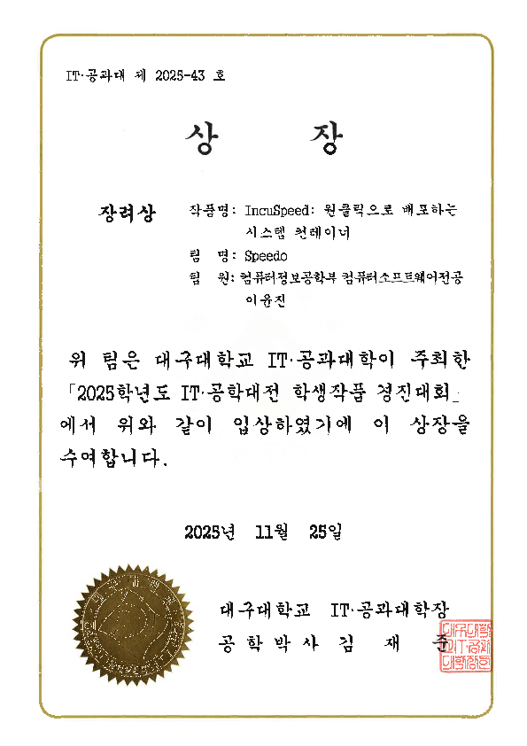
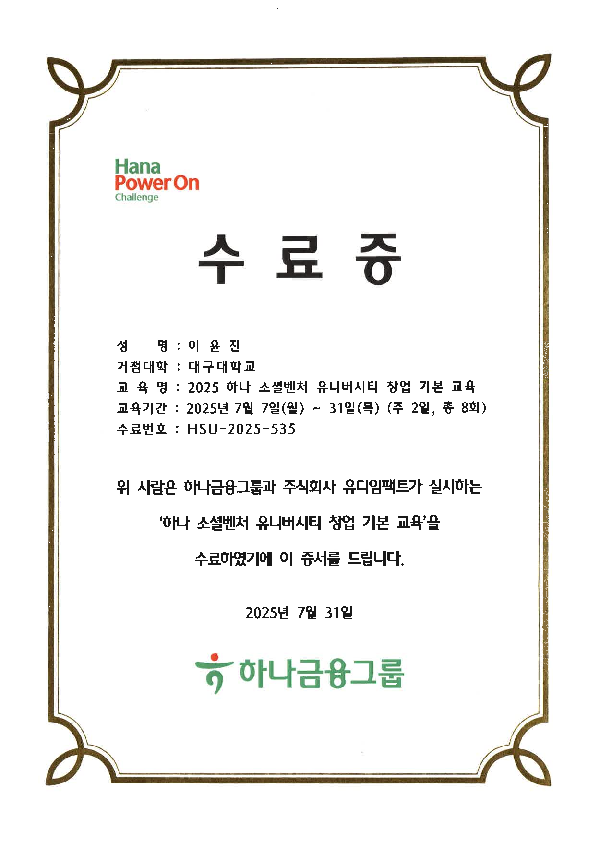

# Hi, I'm Lee Yunjin (@gg582)

I'm a college student interested in Unix/Linux system management, automation scripting, container orchestration, and Go-based development.
Currently learning Java to expand my backend capabilities.

## Focus
- Linux systems & networking
- Automation / IaC (Ansible, Helm, Kubernetes)
- Go services (daemon, CLI, tooling)
- C Programming

```c
/*
 * Tiered execution flow designed for zero-latency branch prediction.
 * Pure C logic utilizing IEEE 754 NaN-space for pointer tagging.
 */
#define BIGINT_TAG_MASK 0xFFF8000000000000ULL
#define EXPONENT_MASK   0x7FF0000000000000ULL

uint64_t next_step(uint64_t n) {
    // First, check if it is `intxx_t`
    if (!(n & 0xC000000000000000ULL)) {
        // this is int, return n << 1; same as return (n * 2)
        return n << 1;
    }

    // Check if it is `libttak` big integer.
    // XOR is great for quickly comparing mask bits
    if (((n ^ BIGINT_TAG_MASK) & BIGINT_TAG_MASK) == 0) {
        return ttak_bigint_mul2(n);
    }

    // 'double *= 2' by incrementing the exponent bits
    // Keeps data within General Purpose Registers, avoiding FPU stalls.
    uint64_t exp_inc = n + (1ULL << 52);
    if ((exp_inc & EXPONENT_MASK) != EXPONENT_MASK) {
        return exp_inc;
    }

    return promote_to_bigint_and_mul2(n);
}

#define TAG_MSK 0xFFF8000000000000ULL
#define EXP_MSK 0x7FF0000000000000ULL

uint64_t scale_val(uint64_t n) {
    // First, check if it is `intxx_t`
    if (!(n & 0xC000000000000000ULL)) {
        // this is int, return n << 1; same as return (n * 2)
        return n << 1;
    }

    // Check if it is `libttak` big integer.
    // XOR is great for quickly comparing mask bits
    if (((n ^ TAG_MSK) & TAG_MSK) == 0) {
        return core_big_mul2(n);
    }

    // 'double *= 2' by incrementing the exponent bits
    // Keeps data within General Purpose Registers, avoiding FPU stalls.
    uint64_t next_f = n + (1ULL << 52);
    if ((next_f & EXP_MSK) != EXP_MSK) {
        return next_f;
    }

    // Final safety net for numbers exceeding double-precision limits.
    // We went too far, just 'toss' this number as a huge double.
    // If a programmer want to cast, use other functions:
    return promote_t_big_double_and_mul2(n);
}
```

## Key Projects
### RemoteCarFromMonet
- Kubernetes-integrated remote car control system (C motor driver + Go-based deployment)
- Stack: C, Go, Shell, Kubernetes
- [Link](https://github.com/gg582/remotecarfrommonet)

### AvianRaptorNet
- Tiny image classifier inspired by avian tectofugal/thalamofugal visual pathways
- Stack: PyTorch, Python
- [Link](https://github.com/gg582/avianraptornet)

### Linux-Mountain
- Linux kernel/networking tweaks for more predictable latency (BBR / ECMP / NAPI experiments)
- Stack: C, Linux kernel
- [Link](https://github.com/gg582/linux-mountain)

### SSH-Chatter
- TUI-based BBS/chat server over SSH/TELNET
- Stack: C, Linux
- [Link](https://github.com/gosuda/ssh-chatter)

### DevOpsPlayground
- Reproducible Kubernetes cluster/service tooling (Helm/Ansible/Shell)
- Stack: Kubernetes, Helm, Ansible, Shell
- [Link](https://github.com/gg582/devopsplayground)

### IncuSpeed
- Incus container manager (Python GUI + Go secure daemon)
- Stack: Python, Go, Incus
- [Module](https://github.com/gg582/linux_virt_unit)
- [Application](https://github.com/gg582/incuspeed)
---

## Activities & Credentials
### Research Assistant / Projects
- Research Assistant in national R&D projects (ETRI: 2, NRF: 4)


### Awards



### Certifications
- Industrial Engineer (Information Processing) — passed (Korea)


### Training


---

## Stats (Optional)
[](https://git.io/streak-stats)
[](https://github.com/anuraghazra/github-readme-stats)
[Grade](https://github-readme-stats.vercel.app/api?username=gg582&show_icons=true)

[](https://solved.ac/yoonjin67/)

---

## Contact
- gzblues61@daum.net
