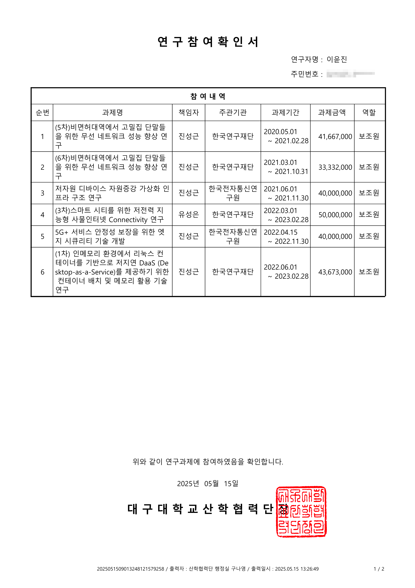
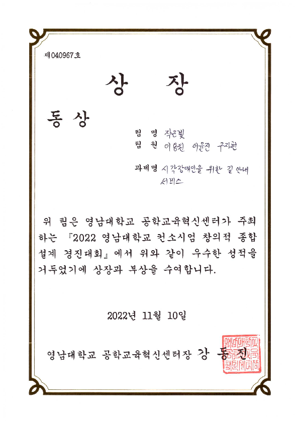
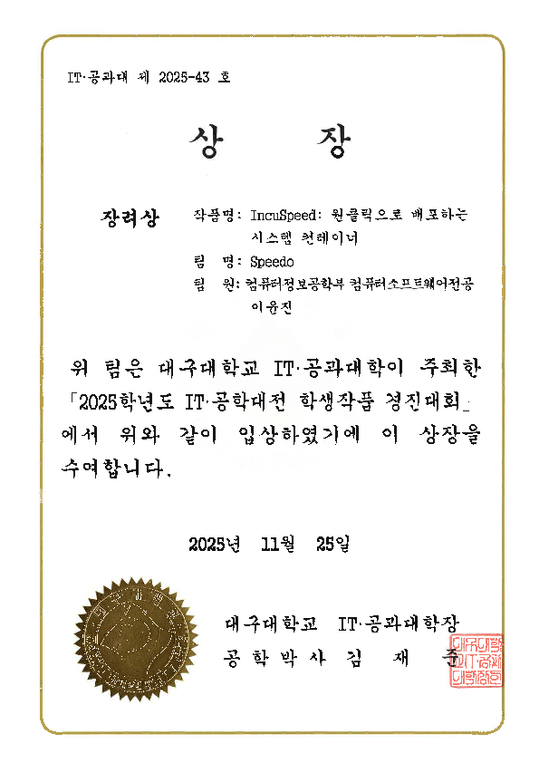
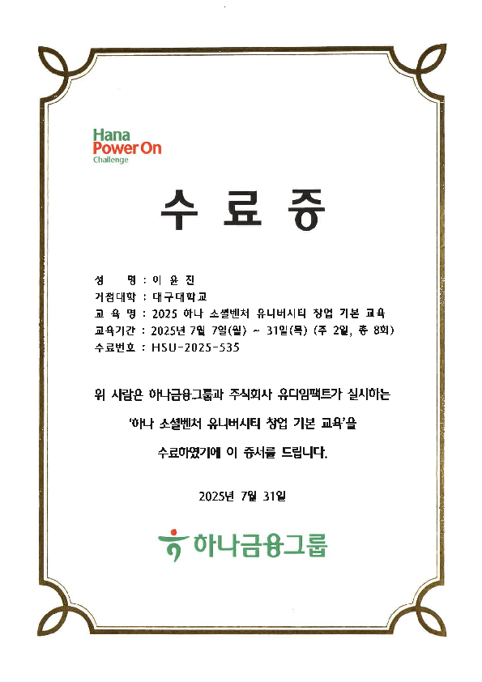

# 안녕하세요, 이윤진(@gg582)입니다

[English README](https://github.com/gg582/gg582/blob/main/README.en.md)

Linux, 네트워킹, 컨테이너 기반 인프라에 집중하는 시스템 레벨 개발자입니다.  
C와 Go를 사용하여 로우레벨 시스템, 재현 가능한 환경, 성능 지향 도구를 만들어온 경험이 있습니다.

현재 인턴십의 일환으로 레거시 Java 환경(OpenJDK 8)을 다루고 있으며, 동시에 커널 레벨 최적화와 인프라 설계에도 꾸준히 관심을 두고 있습니다.

*메타빌드 3개월 인턴십 수행 중 (3월 3일 - 6월 2일)*

## 주요 프로젝트

- **IncuSpeed** — 재현 가능한 컨테이너 환경 관리자 (Python + Go + Incus)  
  → 실제 배포 가능한 테스트 환경을 구축하고 관리한 실무적 경험

- **Linux-Mountain** — 예측 가능한 지연시간을 위한 Linux 커널 및 네트워크 튜닝 (BBR, ECMP, NAPI)  
  → 커널 및 네트워크 계층에서 직접 성능을 최적화한 실전 경험

- **DevOpsPlayground** — 재현 가능한 Kubernetes 클러스터 및 서비스 구성 (Helm, Ansible)  
  → IaC 기반 클러스터 프로비저닝 및 자동화 경험

## 기술 스택

- Go
- Cloud Computing
- Linux
- FreeBSD
- C/C++
- RIOT OS
- Software Optimization
- Java

## 인턴십 트랙

| 난이도 | 중점 영역 | 기술 스택 |
| :--- | :--- | :--- |
| **기초** | 레거시 환경 | OpenJDK 8, PostgreSQL 9.6 |
| **중급** | JDK 마이그레이션 | 레거시 JDK → 최신 JDK (1.6, 1.8, 21) |
| **고급** | 고급 시스템 | Apache Tika, 서버 관리, 디자인 패턴 |
| ***실제로 익힌 내용*** | 기초, 고급(95%), 중급(50%) | 서버 설치 및 구축, 레거시 프로그래밍, 디자인 패턴, Apache Tika |

```diff
! 경험: 여러 JDK 버전(1.6–1.8–21)에 걸쳐 개발하며 레거시 환경에 적응한 경험
+ 강점: 시스템 동작을 명시적으로 제어하고, 레거시 스택과의 호환성을 확보할 수 있음
- 한계: 레거시 관례로 인해 코드가 장황해지고 구조가 깊어지는 경향이 있음
! 통찰: 레거시 시스템을 다룬다는 것은 유지보수성, 호환성, 현대화 사이의 균형을 요구함
````

```bash
~ $ #################>== [90% Done]
```

---

# 이력

* 2021-2022 대구대학교 **MoNet**
* 2022-2023 대구대학교 RESL
* 2023-2025 졸업 작품 준비 (IncuSpeed)
* 2025 정보처리기사, 하나 소셜벤처 유니버시티
* 2026.03.03-2026.06.02 메타빌드 인턴십
* 2026-06~        (?)

## 관심 분야

* Linux 시스템 및 네트워킹

  * 커널 레벨 튜닝
* 자동화 / IaC (Ansible, Helm, Kubernetes)
* Go 서비스 (데몬, CLI, 도구, 웹 개발)
* C 프로그래밍

  * 레거시 리팩토링
  * 시스템 최적화
  * C/C++ 경량 웹 백엔드

```c
/*
 * 분기 예측 지연을 최소화하기 위해 설계된 계층형 실행 흐름
 * IEEE 754 NaN 공간을 포인터 태깅에 활용하는 순수 C 로직
 */
#define BIGINT_TAG_MASK 0xFFF8000000000000ULL
#define EXPONENT_MASK   0x7FF0000000000000ULL

uint64_t next_step(uint64_t n) {
    // 먼저 `intxx_t` 인지 검사
    if (!(n & 0xC000000000000000ULL)) {
        // 정수라면 n << 1 반환, 즉 (n * 2) 와 동일
        return n << 1;
    }

    // 큰 정수인지 검사
    // XOR은 마스크 비트를 빠르게 비교하는 데 유리함
    if (((n ^ BIGINT_TAG_MASK) & BIGINT_TAG_MASK) == 0) {
        return bigint_mul2(n);
    }

    // 지수 비트를 증가시켜 'double *= 2' 수행
    // 데이터를 일반 목적 레지스터 내부에 유지하여 FPU stall을 피함
    uint64_t exp_inc = n + (1ULL << 52);
    if ((exp_inc & EXPONENT_MASK) != EXPONENT_MASK) {
        return exp_inc;
    }

    // 결과를 안전하게 big int 타입으로 승격한 뒤 반환
    return promote_to_bigint_and_mul2(n);
}
```

## 주요 프로젝트

### 인턴십 프로젝트

* Java 1.8 기반 레거시 시스템을 최신 Spring Boot 4.x 애플리케이션 구조로 전환
* 배경: 인턴십 진행 중 "Java 1.8, Spring+MyBatis+Legacy PostgreSQL" 키워드를 기반으로 시작
* 기술 스택: Java, Maven, Spring Boot, MyBatis, Apache Tika, PostgreSQL, BouncyCastle, JPA
* 강점: 명시적인 코드, 각 소스 파일별로 작은 LOC
* 한계: 장황한 코드, 깊고 복잡한 소스 트리, 저장소별로 분절된 서비스 요구사항
* [Spring Boot 링크](https://github.com/gg582/file-mime-checker)
* [Legacy Spring+MyBatis 링크](https://github.com/gg582/spring-development-practice)
* [Legacy Java+Legacy BouncyCastle](https://github.com/gg582/encrymania)

*레거시 Java 환경(1.6–1.8)을 다루면서 호환성과 장기 유지보수 같은 현실적인 제약을 실제로 경험할 수 있었습니다.*

*레거시 아키텍처를 리팩토링하려면 코드 경로, 데이터 흐름, 시스템 동작에 대한 구조적 분석이 선행되어야 하며, 그 위에 관찰 가능하고 측정 가능한 특성을 기준으로 한 표적 개선이 뒤따라야 합니다.*

*장황하고 느슨하게 조직된 코드는 인지 부하를 높이고 유지보수성을 떨어뜨리므로, 구조적 리팩토링은 장기적인 시스템 진화에 필수적입니다.*

### Part 1. 인프라 & 엣지 컴퓨팅

---

### DevOpsPlayground

* 재현 가능한 Kubernetes 클러스터/서비스 도구 모음 (Helm/Ansible/Shell)
* 배경: **대구대학교 MoNet**에서 수행한 클라우드 실험 및 관리 경험
* 기술 스택: Kubernetes, Helm, Ansible, Shell
* 강점: 재현 가능한 환경
* 한계: ACME 서비스 포트 포워딩에 대한 적절한 안내 부족, 도메인을 공인 IP에 연결하는 설정 가이드 부족
* [링크](https://github.com/gg582/devopsplayground)

### IncuSpeed

* Incus 컨테이너 관리자 (Python GUI + Go 보안 데몬)
* 배경: **대구대학교 MoNet**에서 진행했던 *폐기된 프로토타입*
* 기술 스택: Python(최종 사용자 애플리케이션 in KivyMD), Go(백엔드, Incus 추상화 계층), Incus, Bash(설치기)
* 강점: 재현 가능한 깨끗한 Incus 이미지 환경
* 한계: Incus의 많은 기능이 Docker Compose로도 재현 가능함(init 수준 가상화는 제외), LXC 계열은 여전히 진입장벽이 있음
* [모듈](https://github.com/gg582/linux_virt_unit)
* [애플리케이션](https://github.com/gg582/incuspeed)

### RemoteCarFromMonet

* 물리 장치 드라이버와 분산 배포를 결합한 Kubernetes 기반 원격 차량 제어 시스템
* 배경: **대구대학교 MoNet**
* 기술 스택: C, Go, Shell, Kubernetes
* 강점: 물리 장치 제어와 Kubernetes 기반 배포 및 네트워킹 실험의 통합
* 한계: 연구실 외부로 내부 제안서를 반출할 수 없었고, GitLab 서버 유실로 인해 Javascript 기반의 인지 친화적 컨트롤러 대시보드(by @alisherfw)가 제외됨

### Part 2. 시스템 최적화

---

### LibTTAK

* 순수 C를 위한 일관적이고 예측 가능하며 안전한 메모리 모델
* 기술 스택: C
* 강점: 예측 가능한 RSS 사용량과 결정적인 GC 동작
* 배경: SSH-Chatter 같은 대형 레거시 스타일 소프트웨어의 RSS footprint 개선을 위한 로컬 프로토타입
* 한계: 장황한 메모리 관리자 호출, 고립된 생태계
* [링크](https://github.com/religiya-serdtsa/libttak)

### Linux-Mountain

* 더 예측 가능한 지연시간을 위한 Linux 커널/네트워킹 튜닝 (BBR / ECMP / NAPI 실험)
* 배경: **커널 실험**
* 강점: 표준 Linux 커널과의 높은 호환성
* 한계: 표준 커널과 함께 멀티노드 클러스터에 연결했을 때 예측하기 어려운 패턴이 발생할 수 있음
* 기술 스택: C, Linux kernel
* [링크](https://github.com/gg582/linux-mountain)

### RIOTOSMiniCarImplementation

* 규칙에 따라 주행하면서 장애물을 회피하는 차량
* 배경: **대구대학교 RESL**에서 진행한 RIOT OS 실험
* 기술 스택: C, RTOS
* 강점: RIOT OS 기반 GPIO 주변장치 관리, **곤충학(특히 개미)** 에서 영감을 받은 주행 패턴
* 한계: 적응형 또는 학습형 기능이 없는 규칙 기반 내비게이션
* [링크](https://github.com/gg582/RIOTOSMiniCarImplementation)

### Raspberry Pi Raspbot

* Raspberry Pi 4B용 Yahboom 4WD를 위한 디바이스 드라이버 및 테스트 애플리케이션 모음
* 배경: **MoNet**에서 수행한 *폐기된 IoT 실험*
* 기술 스택: C, Linux Device Driver
* 강점: I2C 칩 상호작용을 위한 단순화된 IOCTL 래퍼, 초음파 센서를 위한 포괄적인 핀 인터럽트 핸들러
* 한계: 직접 접근 부재 / Raspberry Pi 카메라를 위한 저수준 CPU 바운드 머신러닝 모델 미구현
* [링크](https://github.com/gg582/raspberry_pi_raspbot)

---

```diff
+ 아래 프로젝트들은 일반적인 프로덕션 제약을 넘어선 실험적 시스템 설계, 저수준 제어, 커스텀 런타임 동작에 초점을 둡니다.
```

### SSH-Chatter

* SSH/TELNET 위에서 동작하는 TUI 기반 BBS/채팅 서버
* 배경: **SSH-Chat, Discord, KakaoTalk**
* 기술 스택: C, Linux
* 강점: 멋진 90년대 레트로 감성
* 한계: 현대의 분산 커뮤니케이션 환경에서는 적용 가능성이 제한적
* [링크](https://github.com/gosuda/ssh-chatter)

### AvianRaptorNet

* 조류의 tectofugal/thalamofugal 시각 경로에서 영감을 받은 초소형 이미지 분류기
* 배경: 대구대학교 머신러닝 수업(이미란 교수), *조류학*
* 기술 스택: PyTorch, Python
* 강점: 초경량
* 한계: 실험적 검증 및 벤치마킹이 제한적
* [링크](https://github.com/gg582/avianraptornet)

### Margo(for fun)

* 커스텀하고, 귀엽고, 모에한 새로운 C 방언
* 배경: **그냥 재미로**
* 기술 스택: C, Margo(자체 언어)
* 강점: 강력한 행렬 함수, 깔끔한 문법
* 한계: 문법 생태계가 지나치게 고립적
* [링크](https://github.com/religiya-serdtsa/margo)

### ChoiCrypt

* 최석정의 육각 귀갑도 문제에서 영감을 받은 셔플을 포함하는 AES-256 변형
* 배경: 대구대학교 암호학 수업(최용호 교수)
* 기술 스택: C
* 강점: S-Box를 넘는 셔플이나 암호 조정을 수반할 경우 공격자가 예측하기 매우 어려움
* 한계: 무거운 커스텀 암호 방식이며, 어디까지나 실험용
* [링크](https://github.com/gg582/choicrypt)

### CWIST

* 순수 C를 위한 쉬운 웹 개발 스위트
* 배경: **왜 C용 Flask는 만들 수 없는가**
* 기술 스택: C
* 강점: 단순한 호출, 쉬운 API, 빠른 MVP 재현, AI 친화적이고 예측 가능한 네이밍
* 한계: HTTP/2 미구현, 암묵적인 코드 라인 존재
* [링크](http://github.com/religiya-serdtsa/cwist)

### Baboship

* 쉬운 EMS 국제우편 배송 예측
* 배경: **우크라이나에서 오던 나의 소련제 11석 알람시계가 도착하지 않아서**
* 기술 스택: C, CWIST(자체), WASM
* 강점: 100% AI 기반 MVP
* 한계: 선편 배송 예측은 지원하지 않음
* [링크](https://github.com/gg582/baboship)
* [웹사이트](https://gg582.github.io/baboship)

### Ceversi

* 가상 베팅룸이 포함된 초경량 Reversi/Othello 대전 웹사이트
* 배경: **ReactJS 같은 외형과 감성을, 전부 C로 SSR 구현**
* 기술 스택: C, CWIST(자체), SQLite
* 강점: 100% AI 기반 MVP
* 한계: 사용자를 붙잡아둘 만큼 게임 기능과 흡인력이 충분하지 않음
* [링크](https://github.com/gg582/ceversi)
* [웹사이트](https://ceversi.korokorok.com)

### Nanox

* UEmacs/PK를 현대적으로 해석한 미니멀리즘 에디터
* 배경: 원격 서버 환경에 대한 개인적 관심
* 기술 스택: C, Legacy C Refactoring(GOD Architecture), ncursesw(UI Modernization)
* 강점: 보기 좋은 Emacs 포크, 초경량
* 한계: 지저분한 레거시 스타일 터미널 커서 관리
* [링크](https://github.com/gg582/nanox)

---

## 활동 및 자격

### 연구 참여 / 프로젝트

* 국가 연구개발 과제 연구보조원 참여 (**ETRI: 2건**, NRF: 4건)



### 수상




### 자격증

* 정보처리기사 합격 (대한민국)


### 교육



---

## 통계 (선택 사항)

[](https://git.io/streak-stats)
[](https://github.com/anuraghazra/github-readme-stats)
[Grade](https://github-readme-stats.vercel.app/api?username=gg582&show_icons=true)

[]

---

## 연락처

* [gg582@proton.me](mailto:gg582@proton.me)
* [gzblues61@daum.net](mailto:gzblues61@daum.net)
